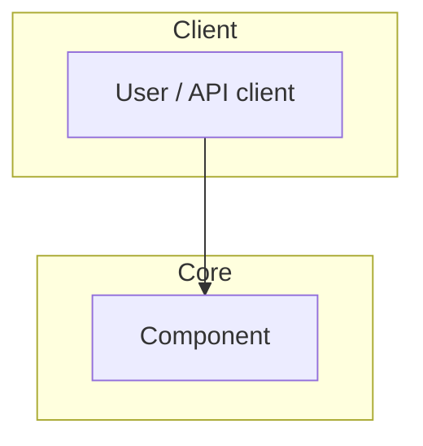

# {Project Name} — 技术解读报告

> **Repo**: {owner}/{repo} · **Mode**: {overview|deep-dive|contributor} · **Date**: {YYYY-MM-DD}
> **采集**: GitHub 页面 + README（preflight，无需脚本）

---

## Executive Verdict

| Persona | Recommendation | Confidence | Rationale |
|---------|----------------|------------|-----------|
| 技术选型者 (Adopter) | Adopt / Evaluate / Avoid | High / Med / Low | {one sentence} |
| 贡献者 (Contributor) | Good entry / Steep curve / Not recommended | ... | ... |
| 学习者 (Learner) | Worth studying / Reference only / Skip | ... | ... |

---

## Dimension Scorecard

| # | Dimension | Score | One-liner | Evidence |
|---|-----------|-------|-----------|----------|
| 1 | Problem Fit | /5 | | [E?] |
| 2 | Architecture | /5 | | [E?] |
| 3 | Entry Points | /5 | | [E?] |
| 4 | Tech Stack | /5 | | [E?] |
| 5 | Extensibility | /5 | | [E?] |
| 6 | Ops Reality | /5 | | [E?] |
| 7 | Quality Signals | /5 | | [E?] |
| 8 | Security & Supply Chain | /5 | | [E?] |
| 9 | Community Health | /5 | | [E?] |
| 10 | Release & Stability | /5 | | [E?] |
| 11 | License & Governance | /5 | | [E?] |
| 12 | Positioning | /5 | | [E?] |

**Overall**: {average or weighted summary in one sentence}

---

## Problem Fit (Dimension 1)

{Paragraph for deep-dive; omit if overview — scorecard one-liner suffices}

---

## Architecture (Dimension 2)

### High-level diagram



### Module map

| Module / path | Responsibility |
|---------------|----------------|
| `path/` | ... |

---

## Entry Points & Reading Order (Dimension 3)

1. `{path}` — {why}
2. `{path}` — {why}
3. ...

---

## Tech Stack (Dimension 4)

| Layer | Choice | Notes |
|-------|--------|-------|
| Language | | |
| Framework | | |
| Key dependencies | | |

---

## Extensibility (Dimension 5)

{How to extend; plugin/hook/API entry points}

---

## Ops Reality (Dimension 6)

### Quick start (verified or from docs)

```bash
git clone --depth 1 {url}
cd {repo}
# install
# test
```

---

## Quality, Security, Community (Dimensions 7–11)

{Expand per mode; overview can merge into short bullets}

### Quality Signals (7)
...

### Security & Supply Chain (8)
...

### Community Health (9)
...

### Release & Stability (10)
...

### License & Governance (11)
...

---

## Positioning (Dimension 12)

| Project | Best for | Tradeoff vs {target} |
|---------|----------|----------------------|
| {peer 1} | | |
| {peer 2} | | |
| **{target}** | | |

---

## README vs Code Verification

*(deep-dive / contributor only)*

| # | Claim (docs) | Verified (code) | Match |
|---|--------------|-----------------|-------|
| 1 | | | ✅ / ⚠️ / ❌ |
| 2 | | | |
| 3 | | | |

---

## Decision Matrix

- **Use if**: ...
- **Skip if**: ...
- **Next step**: clone / read docs / run example / open issue / ...

---

## Risk Register

| Risk | Severity | Evidence | Mitigation |
|------|----------|----------|------------|
| | | [E?] | |

---

## Evidence Index

| ID | Source | What it supports |
|----|--------|------------------|
| E1 | | |
| E2 | | |
| E3 | | |
| ... | | |

---

*Generated with [GitHub in Plain](https://github.com/ning12323/github-in-plain)*
